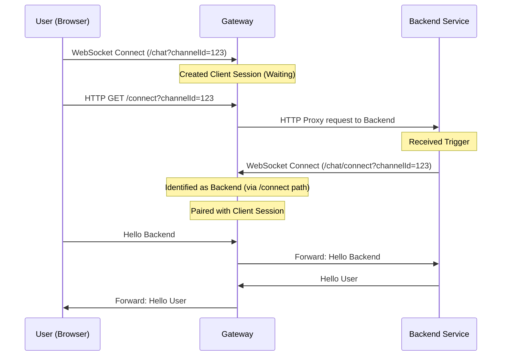

# WebSocket Rendezvous

The `websocket-rendezvous` module provides a specialized WebSocket handler for the "Rendezvous" pattern. This pattern is useful when the Gateway needs to bridge a connection between an external client (e.g., a browser or mobile app) and a backend service that is behind a firewall or NAT and cannot accept incoming connections directly.

In this pattern, both the Client and the Backend service initiate outbound WebSocket connections to the Gateway. The Gateway then "pairs" these two connections based on a shared identifier (`channelId`) and relays messages between them transparently.

## Dependencies

To use this module, add the following dependency to your `pom.xml`:

```xml
<dependency>
    <groupId>com.networknt</groupId>
    <artifactId>websocket-rendezvous</artifactId>
    <version>${version.light-4j}</version>
</dependency>
```

## Configuration

The module is configured via `websocket-rendezvous.yml` (or `values.yml` overrides).

The configuration key is `websocket-rendezvous`.

| Config Path | Default | Description |
| :--- | :--- | :--- |
| `enabled` | `true` | Enable or disable the handler. |
| `backendPath` | `/connect` | The URI path suffix (or segment) used to identify the Backend connection. |

**Example `values.yml` configuration:**

```yaml
websocket-rendezvous:
  enabled: true
  backendPath: /connect
```

## Handler Configuration

To use the handler in a Light-Gateway or Light-4j service, register it in your `handler.yml` or `values.yml` under `handler.handlers` and map it to the desired paths.

```yaml
handler.handlers:
  - com.networknt.websocket.rendezvous.WebSocketRendezvousHandler@rendezvous
  # ... other handlers

handler.paths:
  - path: '/chat'
    method: 'GET'
    exec:
      - rendezvous
  - path: '/connect'
    method: 'GET'
    exec:
      - rendezvous
```

## How It Works

1. **Channel Identification**: Both the Client and the Backend must provide a `channelId` to identify the session. This is typically done via the HTTP header `channel-group-id` or a query parameter `channelId` in the WebSocket upgrade request.

2. **Role Detection**: The handler determines if an incoming connection is a **Client** or a **Backend** based on the request URI.
   - If the request URI contains the configured `backendPath` (default `/connect`), it is treated as the **Backend**.
   - Otherwise, it is treated as the **Client**.

3. **Pairing Logic**:
   - When the **Client** connects, the Gateway creates a new `WsProxyClientPair` and waits for the Backend.
   - When the **Backend** connects (providing the same `channelId`), the Gateway locates the existing session and pairs the Backend connection with the waiting Client connection.
   - Once paired, any message received from the Client is forwarded to the Backend, and vice-versa.

4. **Message Relaying**: The module uses a dedicated `WebSocketRendezvousReceiveListener` to bridge the traffic efficiently.

## Connection Model

The Rendezvous mode uses a **1:1 connection mapping** model:

- For **every** active Client session (identified by a unique `channelId`), the Backend **must** establish a separate WebSocket connection to the Gateway with the same `channelId`.
- There is **no multiplexing** of multiple user sessions over a single Backend connection.
- If you have N users connected to the Gateway, the Backend needs N corresponding connections to the Gateway to serve them.

## Usage Example

**Client Request:**

```http
GET /chat?channelId=12345 HTTP/1.1
Host: gateway.example.com
Upgrade: websocket
Connection: Upgrade
```

**Backend Request:**

```http
GET /chat/connect?channelId=12345 HTTP/1.1
Host: gateway.example.com
Upgrade: websocket
Connection: Upgrade
```

*Note: The Backend connects to a path containing `/connect` (e.g., `/chat/connect`). We recommend using `/chat/connect` (or similar) to differentiate it from the Frontend endpoint `/chat`. Using the same endpoint for both would cause the Gateway to misidentify the Backend as a second Client.*

*Why not just `/connect`?*
*In many setups, `/connect` is reserved as the HTTP trigger endpoint that the UI calls to instruct the Backend to establish the WebSocket connection. Therefore, the Backend should use a distinct WebSocket path like `/chat/connect`.*

## Sequence Diagram


