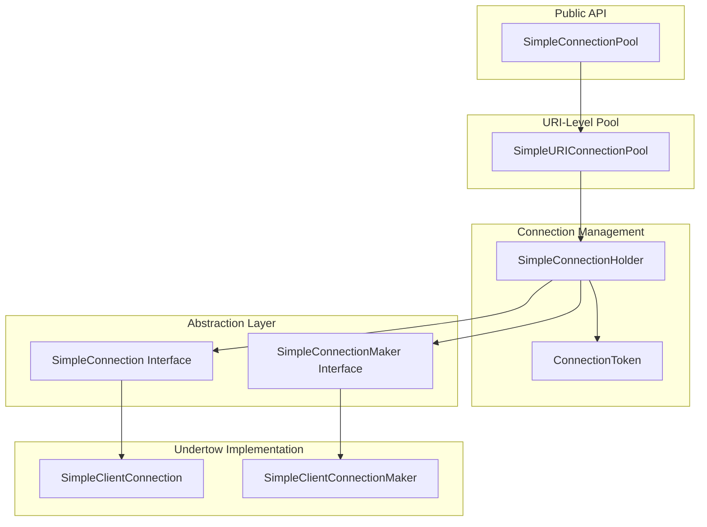

# Client SimplePool Design

## Overview

The SimplePool is a lightweight HTTP connection pooling implementation in the light-4j client module. It was contributed by a customer to address connection management issues in high-throughput scenarios. The implementation provides a robust connection pooling mechanism with support for both HTTP/1.1 and HTTP/2 connections.

## Architecture

The SimplePool follows a layered architecture with clear separation of concerns:



## Core Components

### SimpleConnection (Interface)
A protocol-agnostic interface that wraps raw connections:
- `isOpen()` - Check if connection is still open
- `getRawConnection()` - Access the underlying connection object
- `isMultiplexingSupported()` - Detect HTTP/2 capability
- `getLocalAddress()` - Get client-side address
- `safeClose()` - Safely close the connection

### SimpleConnectionHolder
The central state management component that wraps a `SimpleConnection` and tracks its lifecycle:

**Connection States:**
- `NOT_BORROWED_VALID` - Available for borrowing
- `BORROWED_VALID` - Currently in use
- `NOT_BORROWED_EXPIRED` - Expired, ready for cleanup
- `BORROWED_EXPIRED` - Expired but still in use
- `CLOSED` - Connection terminated

**State Machine:**
```
                    |
                   \/
         [ NOT_BORROWED_VALID ] --(borrow)-->   [ BORROWED_VALID ]
                   |            <-(restore)--           |
                   |                                    |
                (expire)                             (expire)
                   |                                    |
                  \/                                   \/
         [ NOT_BORROWED_EXPIRED ] <-(restore)-- [ BORROWED_EXPIRED ]
                  |
               (close)
                 |
                \/
             [ CLOSED ]
```

**Key Features:**
- **Connection Tokens**: Track borrows with `ConnectionToken` objects
- **Time-Freezing**: All state checks use a consistent "now" timestamp to prevent race conditions
- **Thread-Safe**: All state transitions are `synchronized`
- **HTTP/2 Multiplexing**: HTTP/2 connections support unlimited borrows; HTTP/1.1 limited to 1

### SimpleURIConnectionPool
Manages connections for a single URI with multiple tracking sets:
- `allCreatedConnections` - All connections created by connection makers
- `allKnownConnections` - All connections tracked by the pool
- `borrowable` - Connections available for borrowing
- `borrowed` - Connections with outstanding tokens
- `notBorrowedExpired` - Connections ready for cleanup

**Key Features:**
- Random selection from borrowable connections for load distribution
- Automatic cleanup of expired connections during borrow/restore operations
- Leaked connection detection and cleanup

### SimpleConnectionPool
Top-level pool that manages `SimpleURIConnectionPool` instances per URI:
- Thread-safe map of URI to connection pools
- Lazy initialization of per-URI pools
- Delegates borrow/restore to appropriate URI pool

### SimpleConnectionMaker (Interface)
Factory interface for creating connections with two creation modes:
1. Simplified mode using `isHttp2` boolean
2. Full control mode with XnioWorker, SSL, ByteBufferPool, and OptionMap

### Undertow Implementation
- **SimpleClientConnection**: Wraps Undertow's `ClientConnection`
- **SimpleClientConnectionMaker**: Creates connections using `UndertowClient` or `Http2Client`

## Integration with Http2Client

The `Http2Client` class integrates SimplePool via:
- `borrow(URI, XnioWorker, ByteBufferPool, ...)` methods - Get connection token
- `restore(ConnectionToken)` method - Return connection to pool

```java
// Usage pattern
ConnectionToken token = http2Client.borrow(uri, worker, bufferPool, isHttp2);
try {
    ClientConnection connection = (ClientConnection) token.getRawConnection();
    // Use connection...
} finally {
    http2Client.restore(token);
}
```

## Configuration

The pool behavior is controlled via `ClientConfig`:
- `connectionExpireTime` - How long connections remain valid (default from config)
- `connectionPoolSize` - Maximum connections per URI (default from config)
- `request.connectTimeout` - Connection creation timeout

## Code Review Findings

### Strengths

1. **Well-Documented State Machine**: The connection state transitions are clearly documented with diagrams in code comments.

2. **Thread Safety**: Proper synchronization with `synchronized` methods and `ConcurrentHashMap` usage.

3. **Time-Freezing Pattern**: Excellent approach to prevent time-of-check-time-of-use (TOCTOU) race conditions by passing a consistent `now` value.

4. **Leak Detection**: The `findAndCloseLeakedConnections()` method handles edge cases where connections are created but not properly tracked.

5. **HTTP/2 Multiplexing Support**: Proper differentiation between HTTP/1.1 (single borrow) and HTTP/2 (unlimited borrows).

6. **Random Connection Selection**: Uses `ThreadLocalRandom` for efficient, fair distribution of connections.

7. **Comprehensive Logging**: Detailed debug logging with connection port and state information.

### Resolved Issues

The following issues were identified during code review and have been fixed:

#### 1. Race Condition in SimpleConnectionPool.borrow() ✅ Fixed
**Location**: [SimpleConnectionPool.java](file:///home/steve/networknt/light-4j/client/src/main/java/com/networknt/client/simplepool/SimpleConnectionPool.java)

**Issue**: Double-checked locking had a subtle race condition.

**Fix**: Replaced with atomic `computeIfAbsent()`:
```java
SimpleURIConnectionPool pool = pools.computeIfAbsent(uri,
    u -> new SimpleURIConnectionPool(u, expireTime, poolSize, connectionMaker));
return pool.borrow(createConnectionTimeout);
```

#### 2. Unused isHttp2 Parameter ✅ Fixed
**Location**: [SimpleConnectionPool.java](file:///home/steve/networknt/light-4j/client/src/main/java/com/networknt/client/simplepool/SimpleConnectionPool.java)

**Fix**: Removed the unused `isHttp2` parameter from the `borrow()` method signature.

#### 3. NPE Risk in Http2Client.restore() ✅ Fixed
**Location**: [Http2Client.java](file:///home/steve/networknt/light-4j/client/src/main/java/com/networknt/client/Http2Client.java)

**Fix**: Added null check before calling restore:
```java
SimpleURIConnectionPool pool = pools.get(token.uri());
if(pool != null) pool.restore(token);
```

#### 4. Singleton Pattern Thread Safety ✅ Fixed
**Location**: [SimpleClientConnectionMaker.java](file:///home/steve/networknt/light-4j/client/src/main/java/com/networknt/client/simplepool/undertow/SimpleClientConnectionMaker.java)

**Fix**: Implemented thread-safe singleton using the Holder pattern:
```java
private static class Holder {
    static final SimpleClientConnectionMaker INSTANCE = new SimpleClientConnectionMaker();
}
public static SimpleConnectionMaker instance() {
    return Holder.INSTANCE;
}
```

#### 5. Missing Null Check in SimpleConnectionPool.restore() ✅ Fixed
**Location**: [SimpleConnectionPool.java](file:///home/steve/networknt/light-4j/client/src/main/java/com/networknt/client/simplepool/SimpleConnectionPool.java)

**Fix**: Added null checks for both the connection token and the pool:
```java
if(connectionToken == null) return;
SimpleURIConnectionPool pool = pools.get(connectionToken.uri());
if(pool != null) pool.restore(connectionToken);
```

#### 6. Hardcoded Worker Configuration ✅ Improved
**Location**: [SimpleClientConnectionMaker.java](file:///home/steve/networknt/light-4j/client/src/main/java/com/networknt/client/simplepool/undertow/SimpleClientConnectionMaker.java)

**Fix**: Extracted hardcoded value to a named constant for clarity:
```java
private static final int DEFAULT_WORKER_IO_THREADS = 8;
```

> [!NOTE]
> The Static Worker and SSL Reuse concern (TODO comments about reusing WORKER and SSL) remains as a documented consideration for future enhancement if configuration reloading becomes a requirement.

## Best Practices Observed

1. **Functional Interface with Lambda**: The `RemoveFromAllKnownConnections` interface provides flexibility for Iterator-based or direct removal.

2. **Explicit State Assertions**: Using `IllegalStateException` for invalid state transitions aids debugging.

3. **Comprehensive Javadoc**: Methods include detailed documentation about thread safety and usage patterns.

4. **Connection Token Pattern**: Ensures connections can be tracked and returned correctly, preventing leaks when used properly.

## Summary

The SimplePool implementation is a well-designed, production-quality connection pool with excellent documentation and careful attention to thread safety. All identified issues have been resolved. The implementation successfully handles:

- Connection lifecycle management
- HTTP/1.1 and HTTP/2 protocol differences
- Connection expiration and cleanup
- Leak detection and prevention
- Thread-safe concurrent access

## New Features

### Pool Metrics

Connection pool metrics can be enabled via configuration to track:
- Total borrows and restores per URI
- Connection creation and closure counts
- Borrow failures
- Current active connection count

```yaml
client:
  request:
    poolMetricsEnabled: true
```

#### Metrics Usage Examples

**Basic metrics access:**
```java
Http2Client client = Http2Client.getInstance();
SimplePoolMetrics metrics = client.getPoolMetrics();
if (metrics != null) {
    // Get summary for logging
    logger.info(metrics.getSummary());
    
    // Access per-URI metrics
    for (Map.Entry<URI, SimplePoolMetrics.UriMetrics> entry : metrics.getAllMetrics().entrySet()) {
        URI uri = entry.getKey();
        SimplePoolMetrics.UriMetrics uriMetrics = entry.getValue();
        
        logger.info("Pool {} - active: {}, borrows: {}, restores: {}, created: {}, closed: {}, failures: {}",
            uri,
            uriMetrics.getActiveConnections(),
            uriMetrics.getTotalBorrows(),
            uriMetrics.getTotalRestores(),
            uriMetrics.getTotalCreated(),
            uriMetrics.getTotalClosed(),
            uriMetrics.getBorrowFailures());
    }
}
```

**Periodic metrics logging (e.g., every 5 minutes):**
```java
ScheduledExecutorService scheduler = Executors.newSingleThreadScheduledExecutor();
scheduler.scheduleAtFixedRate(() -> {
    SimplePoolMetrics metrics = Http2Client.getInstance().getPoolMetrics();
    if (metrics != null) {
        logger.info(metrics.getSummary());
    }
}, 5, 5, TimeUnit.MINUTES);
```

**Exposing metrics via REST endpoint:**
```java
@GET
@Path("/pool/metrics")
public Response getPoolMetrics() {
    SimplePoolMetrics metrics = Http2Client.getInstance().getPoolMetrics();
    if (metrics == null) {
        return Response.status(503).entity("Metrics not enabled").build();
    }
    
    Map<String, Object> result = new HashMap<>();
    for (Map.Entry<URI, SimplePoolMetrics.UriMetrics> entry : metrics.getAllMetrics().entrySet()) {
        SimplePoolMetrics.UriMetrics m = entry.getValue();
        result.put(entry.getKey().toString(), Map.of(
            "active", m.getActiveConnections(),
            "borrows", m.getTotalBorrows(),
            "restores", m.getTotalRestores(),
            "created", m.getTotalCreated(),
            "closed", m.getTotalClosed(),
            "failures", m.getBorrowFailures()
        ));
    }
    return Response.ok(result).build();
}
```

### Pool Warm-Up

Pre-establish connections to reduce latency on first request:

```yaml
client:
  request:
    poolWarmUpEnabled: true
    poolWarmUpSize: 2
```

Programmatic warm-up:
```java
Http2Client client = Http2Client.getInstance();
client.warmUpPool(URI.create("https://api.example.com:8443"));
```

### Connection Health Checks

Background thread validates idle connections and removes stale ones:

```yaml
client:
  request:
    healthCheckEnabled: true
    healthCheckIntervalMs: 30000
```

#### Health Check Usage Examples

**Graceful shutdown:**
```java
// In your application shutdown hook
Runtime.getRuntime().addShutdownHook(new Thread(() -> {
    Http2Client.getInstance().shutdown();
    logger.info("Http2Client shutdown complete");
}));
```

**With Server module shutdown listener:**
```java
public class ClientShutdownListener implements ShutdownHookProvider {
    @Override
    public void onShutdown() {
        Http2Client.getInstance().shutdown();
    }
}
```

**Monitoring pool health programmatically:**
```java
Http2Client client = Http2Client.getInstance();
Map<URI, SimpleURIConnectionPool> pools = client.getPools();

for (Map.Entry<URI, SimpleURIConnectionPool> entry : pools.entrySet()) {
    SimpleURIConnectionPool pool = entry.getValue();
    logger.info("Pool {} - active: {}, borrowable: {}, borrowed: {}",
        entry.getKey(),
        pool.getActiveConnectionCount(),
        pool.getBorrowableCount(),
        pool.getBorrowedCount());
}
```

**Complete configuration example:**
```yaml
client:
  request:
    # Connection timeouts
    connectTimeout: 10000
    timeout: 3000
    
    # Pool sizing
    connectionPoolSize: 10
    connectionExpireTime: 1800000
    
    # Metrics (disabled by default)
    poolMetricsEnabled: true
    
    # Warm-up (disabled by default)
    poolWarmUpEnabled: true
    poolWarmUpSize: 2
    
    # Health checks (enabled by default)
    healthCheckEnabled: true
    healthCheckIntervalMs: 30000
```

