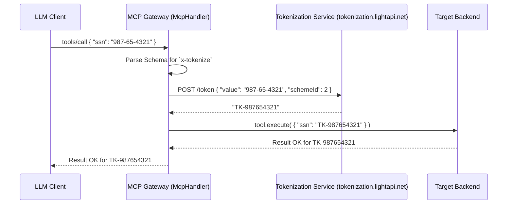

# Reversible Data Tokenization

The MCP Gateway provides robust Data Tokenization to safely invoke external MCP tools and LLMs without exposing sensitive Personally Identifiable Information (PII) like SSNs, credit card numbers, or proprietary business identities. 

While the standard `mask` module is destructive (replacing data with asterisks), Tokenization replaces sensitive data with format-preserving proxy tokens (e.g., `TK-1234`). This allows the LLM to still reason about identity relations semantically, while permitting authorized parties to later reverse the token to the original value using the `tokenization.lightapi.net` service.

## Dual-Layer Protection Strategy

The MCP Gateway employs tokenization and masking directly inside the `McpHandler` execution layer before it ever reaches external network boundaries. 

### 1. Request Tokenization (Protecting External Tools / LLMs)
If the backend or external MCP tool does not inherently require the real PII to function, the Gateway intercepts the incoming `tools/call` JSON payload and evaluates it against the Tool's Schema. If a field is explicitly marked for tokenization (`"x-tokenize": <schemeId>`), the Gateway calls the Tokenization Service to exchange the real value for a proxy token before invoking the tool adapter.

### 2. Response Masking (Global Rules)
For data exiting a backend that could unintentionally contain PII, the Gateway utilizes predefined paths inside `mask.yml` to automatically scrub or tokenize the specific fields inside the `result` JSON payload before returning it to the context window of the LLM.

## Schema Configuration

To enable Tokenization for an external tool, append the `"x-tokenize": <schemeId>` attribute to the properties in the `inputSchema` configuration of your MCP Tool Registry.

*Note: The `schemeId` directly correlates to the token generation algorithms mapped inside your `tokenization.lightapi.net` API (for instance, `schemeId: 1` might be LNT4).*

```json
{
  "name": "lookup_user",
  "description": "Searches for a user by their identity.",
  "inputSchema": {
    "type": "object",
    "properties": {
      "ssn": {
        "type": "string", 
        "x-tokenize": 2
      },
      "query": {
        "type": "string",
        "description": "Standard unstructured prompt. This will fallback to global regex regex redaction if bad data is typed."
      },
      "credit_card": {
        "type": "string",
        "x-mask": true
      }
    }
  }
}
```
*In this example, the `ssn` is fully tokenized so it can be reversely searched later, whereas the `credit_card` is permanently masked using the Gateway's destructive regex scrubbing.*

## Architecture & Transport

The MCP Gateway handles these exchanges using an ultra-low latency `TokenizationService` built natively using `light-4j`'s `Http2Client` `SimplePool` architecture.



### Detokenization Ownership

The MCP Gateway **does not** perform detokenization (`GET /token/{token}`) on final streaming responses from the LLM back to the user. This reverse-lookup process must be securely executed at the outer-most architectural edge—typically by the employee-facing Frontend Application or a dedicated Egress chat router configured with explicit `token.r` OAuth client-credential scopes.
